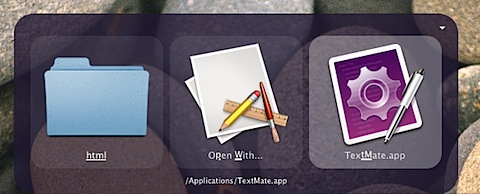
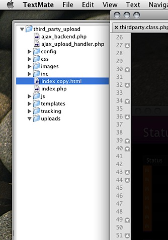
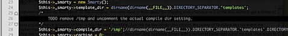
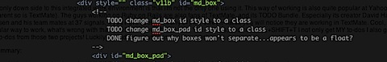
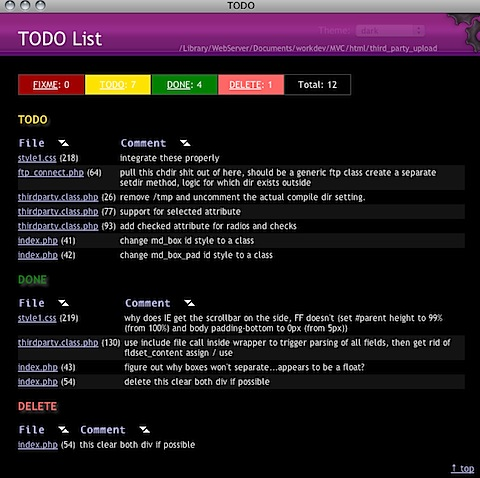
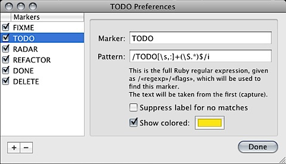
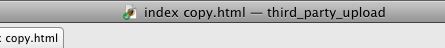
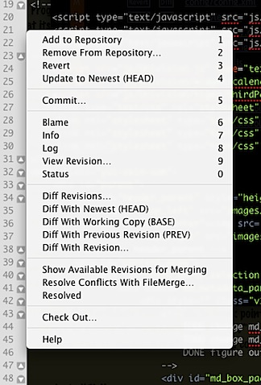
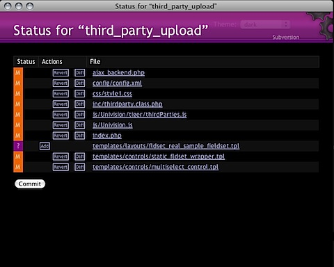

All Programmers swear by their editor. Its like a religion. You only need to think about the ongoing joke of emacs vs vi in the Unix world to get a sense of the fact that its not something we take lightly.

One very popular choice of editor on Mac is [Macromates&#8217; TextMate](http://macromates.com/). Just like the two iconic Unix editors, the power of TextMate lies not within the application itself, although, it IS an incredible application, it fits in just seemlessly with the rest of the User Experience in OS X, and it integrates pretty nicely with popular Mac FTP client [Transmit](http://www.panic.com/transmit/) . No, the REAL power of TextMate lies in its plugin architecture. These plugins are called &#8220;Bundles&#8221;. And TextMate comes with a million of these right out of the box. This leads to people having different methodologies for how they like to use TextMate.

My career is in Web Development, so that is going to be the workflow I describe here. I also plan to use TextMate more for Cocoa / Objective-C as I learn the language, but for now I code that mostly in XCode.

I typically program in a very web-centric list of languages: PHP, Javascript, HTML, CSS, XML, SQL. The syntax highlighting for all of these is very good, its even smart enough to notice if I have SQL being set into a PHP variable and highlight that string appropriately. For example:


I would like drop-down autocompletion like what you see in alot of bloated IDE&#8217;s, but really, I know all these languages so well, that would just be indulging a lazy typist. For Javascript, [YUI](http://developer.yahoo.com/yui/) is typically my framework of choice, I have installed [a Bundle for it](http://techfoolery.com/archives/2006/10/29/1406/) that offers parameter help, tons of macros / code snippets whatever you want to call them, and highlighting of built-in YUI classes / methods.

I almost always work in &#8220;project mode&#8221;, not sure if thats the real name, but its what I call it. Its what happens when you open a folder with TextMate, you can do this by dragging the folder to the icon, through the command line utility (mate foldername/ ) or through Quicksiver (my personal favorite)



this will give you the &#8220;Project Drawer&#8221; which is the file browser type thing you are used to seeing in a lot of desktop text editors / IDEs:



If its a folder you work with frequently, you can save this as a project through File > Save Project As&#8230; , and then just open that file whenever you want the same folders loaded in your project drawer. You can use [this project trick](http://muffinresearch.co.uk/archives/2006/06/13/use-tabs-in-textmate-for-remote-files-opened-by-transmit/) to get all your [Transmit (FTP client)](http://www.panic.com/transmit/) files to open in TextMate with tabs (instead of each file in its own window.)

I like to use the TextMate TODO Bundle to track points in my code where I have something to do(as the name implies), I can also flag code to fix with &#8220;FIXME&#8221; and mark any of these items as done with the keyword &#8220;CHANGED&#8221; in my comments. (I actually modified the plugin to use the word DONE instead, but CHANGED is the default) . The bundle works by placing specially formatted comments like so (either manually or by triggering the code snippet by typing &#8220;todo&#8221; followed by a TAB):



also works in HTML:



the bundle is smart enough to know the appropriate kind of comments for the language you cursor is currently sitting in.

you can then get a list of all your outstanding action items (or &#8220;Next Actions&#8221; for you GTDers out there) with a simple CTRL+SHIFT+T:



This methodology allows me to track what I need to do WHERE I need to do it. And the filenames you see on the left with the line numbers next to them are links that will jump right to that line in the file, and put your cursor there. (for the image above, note that I added my own &#8220;DELETE&#8221; comment and renamed &#8220;CHANGED&#8221; to &#8220;DONE&#8221; as I mentioned above..its amazing how easy this is to do if you go to Bundles > TODO > Preferences )



The only down side to this integrated work environment is that I&#8217;m not the only one using it. This way of working is also quite popular at Yahoo! (and apparently so is TextMate). The guys working on [Ruby on Rails](http://www.rubyonrails.org/) are also fans of TextMate, and its TODO Bundle. Especially its creator [David Heinemeier Hansson](http://en.wikipedia.org/wiki/David_Heinemeier_Hansson) and his team at [37 signals](http://www.37signals.com/), if you have ever seen any of their [rails screen-casts](http://www.rubyonrails.org/screencasts), you will notice they are working in TextMate. Cool, its a popular way to work, what&#8217;s wrong with that? Well, whenever I work in a project where I use YUI or Rails, and hit CTRL+SHIFT+T I not only get MY to-dos I also get all of the to-dos from those projects! Luckily I found the solution in this blog post:

[Ex dolo with intent: exdolo.com](http://exdolo.com/2006/10/18/ignoring-vendor-rails-from-textmate-s-todo-bundle)

if you&#8217;re too lazy to click through to the post:

Go to Preferences &gt; Advanced &gt; Folder References and change the Folder Pattern from:

```
!.\*/(.[^/]\*|CVS|\_darcs|{arch}|blib|.\*~.nib|.\*.(framework|app|pbproj|pbxproj|xcode(proj)?|bundle))\\\\\\\\\\$
```

to:

```
!.\*/(.[^/]\*|rails|CVS|\_darcs|{arch}|blib|.\*~.nib|.\*.(framework|app|pbproj|pbxproj|xcode(proj)?|bundle))\\\\\\\\\\$
```

the equivalent expression I use for YUI:

```
!.\*/(.[^/]\*|yui|CVS|\_darcs|{arch}|blib|.\*~.nib|.\*.(framework|app|pbproj|pbxproj|xcode(proj)?|bundle))\\\\\\\\\\$
```

Your milage may vary, I put all the YUI modules in the /js/yui/&#8230; directory of my projects, so filtering for the yui folder works for me.

The final piece of the puzzle is, of course, source control. I have a Subversion repository hosted at [DreamHost](http://www.dreamhost.com/). I simply followed [these instructions](http://wiki.dreamhost.com/index.php/Subversion) for setting up a subversion repository, and just for kicks set up a Trac server. I really recommend using the HowTo and [script posted here](http://wiki.dreamhost.com/DreamTracInstall).

I then import / checkout my subversion repository from the command-line. It is very important to do your first checkout with username and password. A lot of Mac GUI clients try to make life too easy for you, and they will use the authentication credentials used to create the repository. I then install the [Subversion plugin for Finder](http://scplugin.tigris.org/), and use the Subversion Bundle for TextMate (you knew that was coming, didn&#8217;t you).

Also, the subversion plugin for finder adds a little [badge overlay to the icons in finder](http://scplugin.tigris.org/screenshots.html). Which is nice, because that same badge shows up in your title area in TextMate. see the little green dot with a check mark in the lower left corner of the html icon that tells me this is the latest working version of the file, a red dot with an &#8220;X&#8221; means my file has been locally modified, Yellow dot with questionmark means it doesn&#8217;t exist in the repository (needs to be added), and so on.



The subversion TextMate bundle has alot of advantages. For instance, I tend to work in a lot of different files in just a couple of hours. MVC development and Ajax work quickly increase the number of files you are touching. One Ajax call can involve the HTML page its its made from, a separate Javascript file, the PHP page receiving your Ajax call, and the controller underlying that page (hopefully you don&#8217;t need to touch the model.) After 3 or 4 hours of this, I have probably modified at least 10 files. This is where TextMate and the Subversion bundle make my life very easy. I can get the subversion status, which tells me what is modified, what files are not in the repository ( have a ? ), are added to the repository, but not had their first commit, etc. I can pull this status at the root of my project. With the project drawer open select the top-level folder and hit CTRL+SHIFT+A to get a context-type menu:



from this hit &#8220;0&#8221;&#8230;thats a zero, not a letter &#8220;o&#8221;. TextMate will generate a nice little report like this for you. And as an added bonus, its a completely interactive HTML form, you can add, diff, revert your files directly from the report, and then hit the commit button to commit all your work to the Subversion server!



Working with TextMate is absolutely the best experience I have had with a text editor / IDE. And I have tried more than a few, was actually quite happy with Zend Studio, and use it for its debugging, remote debugging capability, but I look forward to the day I can do this from within TextMate as well! If you are trying out TextMate, I recommend taking a look at the bundle it includes for the language you typically work in, by going to Bundles in the Menu, there are all sorts of cool stuff, for instance, PHP can execute the files and show you the output, or verify the file for syntax errors. Every couple of months I try a new editor (Alot of Ajax IDEs are coming out now a days!) but always find myself coming back.

Love TextMate? Hate it? Think I&#8217;m an idiot and should use BBEdit instead? Tell me in the comments!
